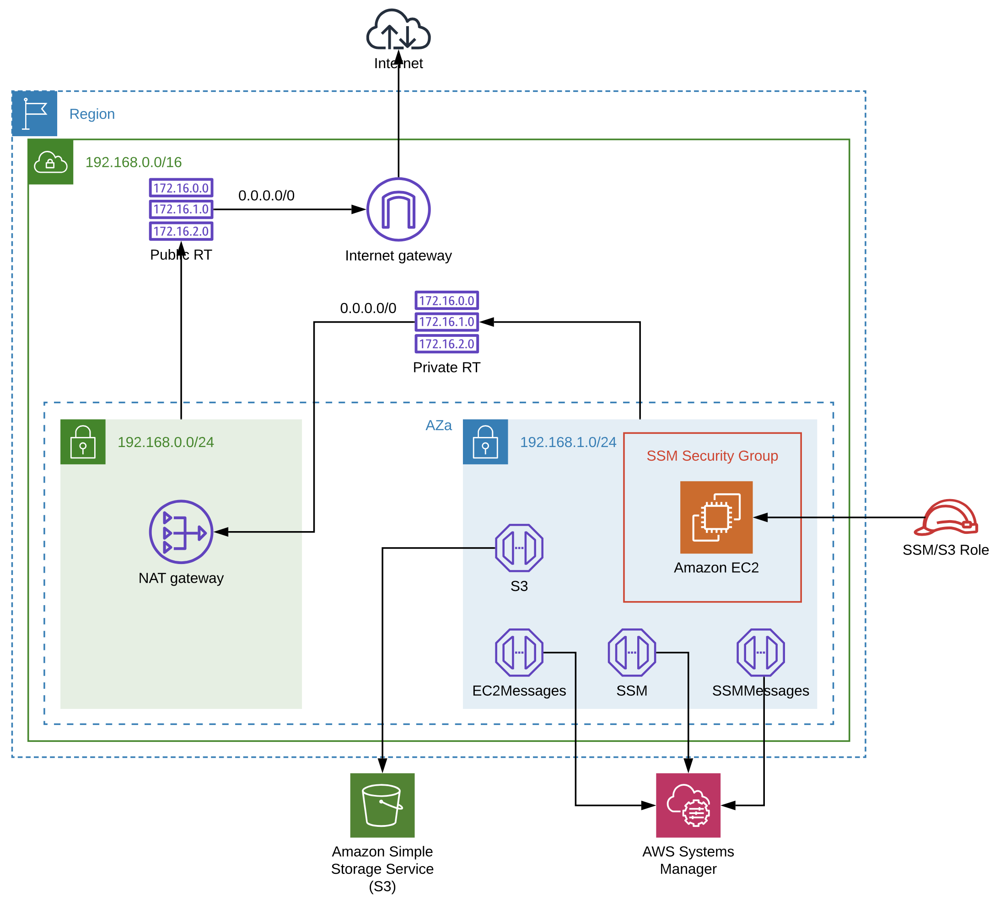
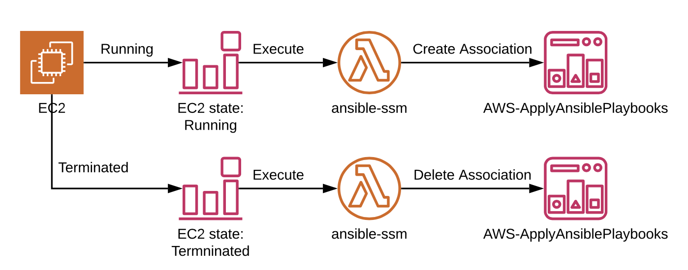

## SSM-Ansible

This is a basic POC to show capabilities of SSM State Manager Document AWS-ApplyAnsiblePlaybooks.

* Create an EC2 instance, a SSM State Manager Association will be created and apply a provision playbook to the 
instance.
* If the instance is stopped, then started again, the Association will be updated and apply an update playbook to the 
instance.
* Terminate the instance, the Association will be deleted.

### Preparing environment
Execute the commands in each of the following sections:
* [Terraform](terraform/README.md)
* [Cloudformation](cloudformation/README.md)
* [Ansible](ansible/README.md)

The following should be the end result:

### Provision
* Create an EC2 instance in the private subnet of the vpc created by [ssm_network](cloudformation/ssm_network.yml) and 
assign the role created by [ssm_global](cloudformation/ssm_global.yml) to the instance. 
    * An SSM State Manager Association will be created and apply a provision playbook to the instance.
* If the instance is stopped, then started again, the Association will be updated and apply an update playbook to the 
instance.
* Terminate the instance, the Association will be deleted.

Workflow of above:

#### Disclaimer
I'm by no means an expert in Ansible or Python, so I know some of what I've done probably isn't best practices. 